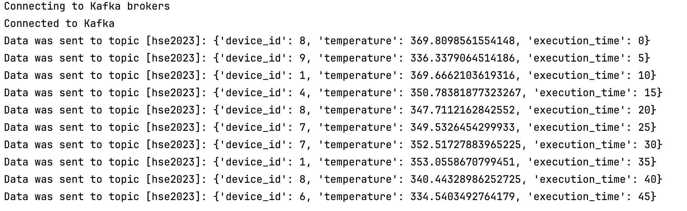

# Домашнее задание 3: Flink

## Блок 1: Flink checkpoint

### 1. Развертывание Flink + Kafka через docker-compose

Поднимаем окружение:

```commandline
docker-compose build
```

Поднимаем наши компоненты: jobmanager, taskmanager, kafka, zookeper

```commandline
docker-compose up -d
```

Смотрим процесс:

```commandline
docker-compose ps
```


Проверяем, что во Flink UI, что все корректно создано:

```
http://localhost:8081/#/overview

```


Создаем очередь 'hse2023':

```commandline
docker-compose exec kafka kafka-topics.sh --bootstrap-server kafka:9092 --create --topic hse2023 --partitions 1 --replication-factor 1
```


Проверим, правильно ли создалась очередь -- смотрим описание очереди:

```commandline
docker-compose exec kafka kafka-topics.sh --bootstrap-server kafka:9092 --describe hse2023  
```


### 2. Создание источника и потребителя данных из Kafka

Создадим источник данных. В файле *producer_1.py* генерируем данные функцией *write_data*, через *producer* отправляем
данные в Kafka (пробуем достучаться 6 раз; если не получается, выкидываем ошибку).

Запустим *producer_1.py*, увидим, что данные действительно отправляются в Kafka:



Теперь хотим научиться читать эти данные из Kafka. Создадим consumer (код в файле *consumer_1.py*) c offset 'earliest',
чтобы читать все сообщения в этом топике, включая те, которые там были до момента нашего подключения.

Работа consumer'а:


Чтобы засабмитить job во flink, надо отправить job manager'у задачу запустить наш код на питоне:

```commandline
docker-compose exec jobmanager ./bin/flink run -py /opt/pyflink/device_job.py -d  
```

### 3. Настройка Flink checkpoint и сохранение в local dir

Документация для настройки flink
checkpoint'ов: [checkpointing](https://nightlies.apache.org/flink/flink-docs-master/docs/dev/datastream/fault-tolerance/checkpointing/)
и [checkpoints](https://nightlies.apache.org/flink/flink-docs-master/docs/ops/state/checkpoints/#checkpoint-storage)

В *device_job.py* в *python_data_stream* обновляем окружение env.

Сохраняем чекпоинты в локальную директорию `file:///opt/pyflink/tmp/checkpoints/logs`

Producer:


Consumer:


Отображение засабмиченной job'ы во Flink UI:


Теперь сохраним чекпоинты в hdfs `hdfs://namenode:9870/checkpoints/`

Для этого предварительно добавим hadoop конфигурации, обновим docker-compose и запустим соответствующие сервисы:


Producer:


В связи с ошибкой *'Could not find a file system implementation for scheme 'hdfs'. The scheme is not directly supported
by Flink and no Hadoop file system to support this scheme could be loaded.'* не удалось засабмитить job'у


## Блок 2: Flink Window

Документация для настройки flink
window: [flink windows](https://nightlies.apache.org/flink/flink-docs-release-1.18/docs/dev/datastream/operators/windows/)

Будем группировать сэмплы по device_id и считать максимальную температуру в каждом окне. Напишем свой класс
MaxTemperatureWindowFunction, наследующийся от WindowFunction, чтобы применять эту функцию к окнам.

### Tumbling Windows

Producer:


Consumer:


Отображение засабмиченной job'ы во Flink UI:


### Sliding Windows

Producer:


Consumer:


Отображение засабмиченной job'ы во Flink UI:


### Session Windows

Producer:


Consumer:


Отображение засабмиченной job'ы во Flink UI:


## Блок 3: Kafka backoff

Producer:


Consumer:


Отображение засабмиченной job'ы во Flink UI:


