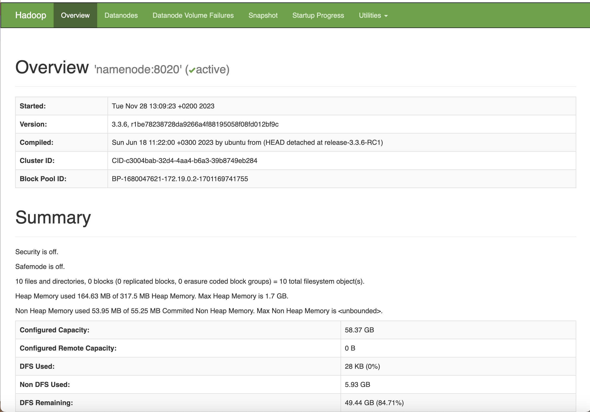
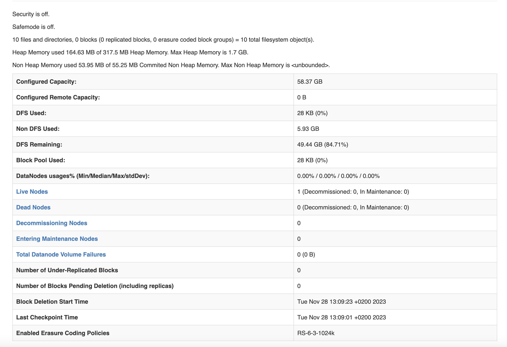
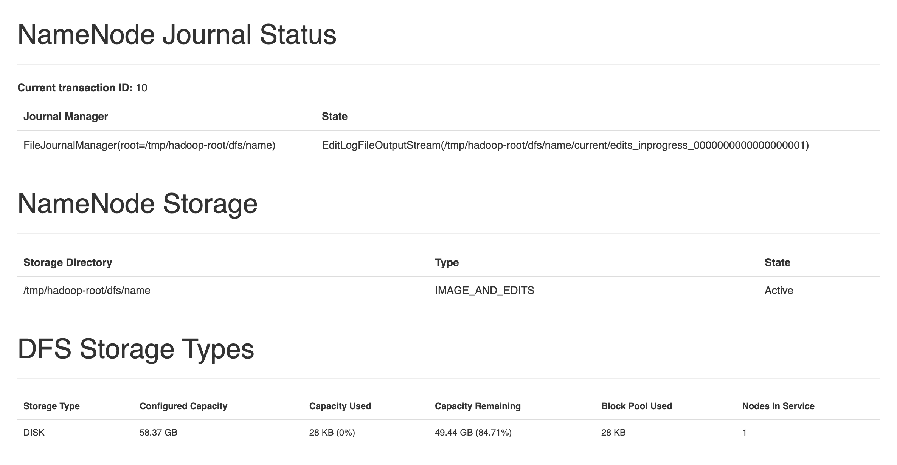
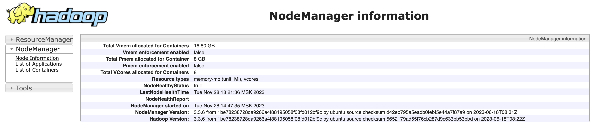
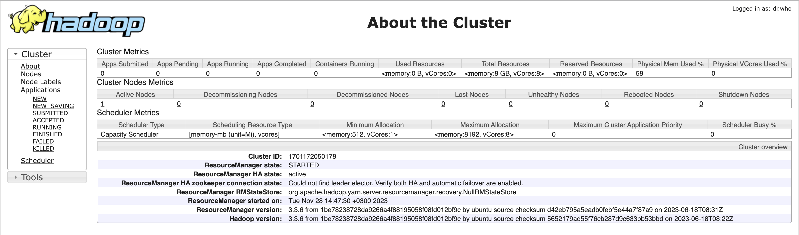

# Домашнее задание 1

## Блок 1. Развертывание локального кластера Hadoop

**Задание**:

1. Развернуть локальный кластер в конфигурации 1 NN, 1-3 DN (в зависимости от доступных мощностей ноутбука), 1-2 NM, 1
   RM.
   Можно использовать готовый docker-compose/ делать по инструкции.
2. Изучить настройки и состояние NM и RM в веб-интерфейсе. Сделать скриншоты NN и RM. Скриншоты добавить в репозиторий.
3. Развернуть юпитер. Создать ноутбук.
4. Из него с помощью питон кода (pyarrow), либо с помощью команд “hadoop fs” загрузить любой файл с данными на hdfs.
5. В отдельных ячейках выполнить команду !hadoop fs -ls (путь до файла) + !hadoop fs -cat
6. Запустить команду !hadoop jar /opt/hadoop/share/hadoop/mapreduce/hadoop-mapreduce-examples-3.3.6.jar pi 15 1800
7. Ноутбук с результатами, а также скриншоты запуска с RM добавить в репозиторий

**Решение**:

Был развернут кластер в конфигурации 1 NN, 1 DN, 1 NM, 1 RM.

Name node info: http://localhost:9870/dfshealth.html#tab-overview

Node manager: http://localhost:8042/node/node

Resource manager: http://localhost:8088/cluster/cluster

С помощью библиотеки pyarrow был создан файл, содержащий текст песни. Ноутбук с результатами: (ссылка)

