# Домашнее задание 2

Ноутбук с кодом домашнего задания:

## Блок 1: Spark Application

Развернем hadoop-кластер в конфигурации 1 namenode, 1 datanode, 1 resourcemanager, 1 nodemanager. Также развернем
jupyter в контейнере

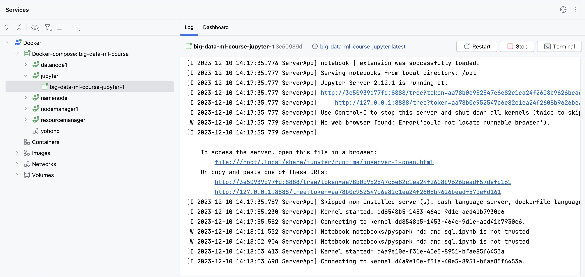

Запустим спарк-сессию (SparkSession) с мастером YARN, 2-мя экзекьюторами и именем приложения “fedotova_spark”,
предварительно выйдя из savemode в hdfs (hdfs dfsadmin -safemode leave).

Зайдем в YARN, увидим развернувшееся приложение.

http://localhost:8088/cluster

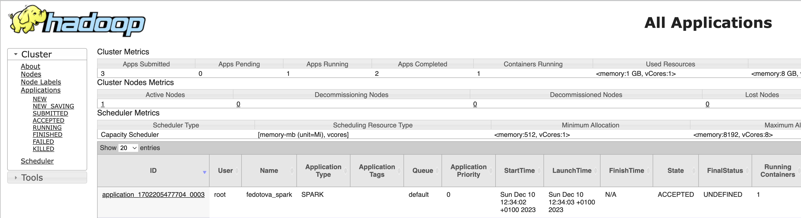
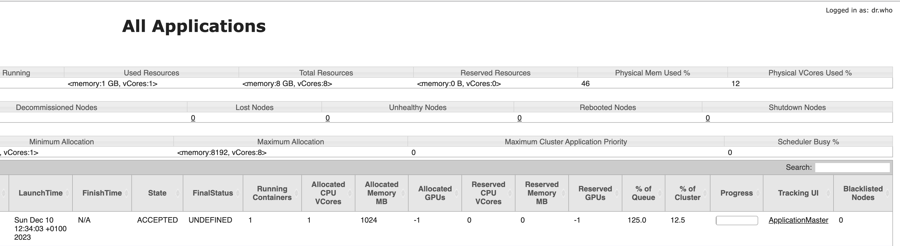

http://localhost:8088/cluster/app/application_1702205477704_0003

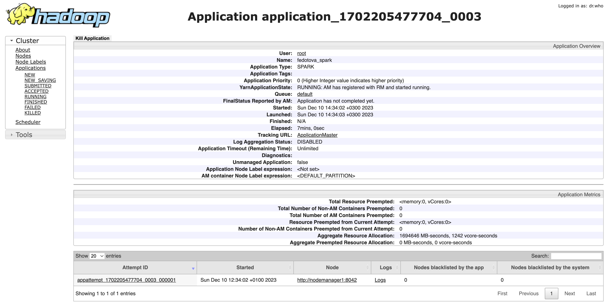

UI приложения spark:

http://localhost:8088/proxy/application_1702205477704_0003/

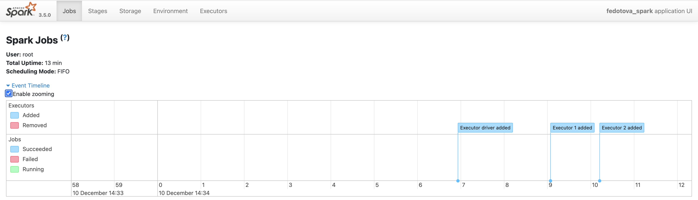
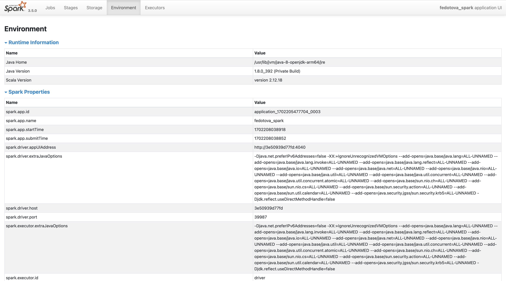
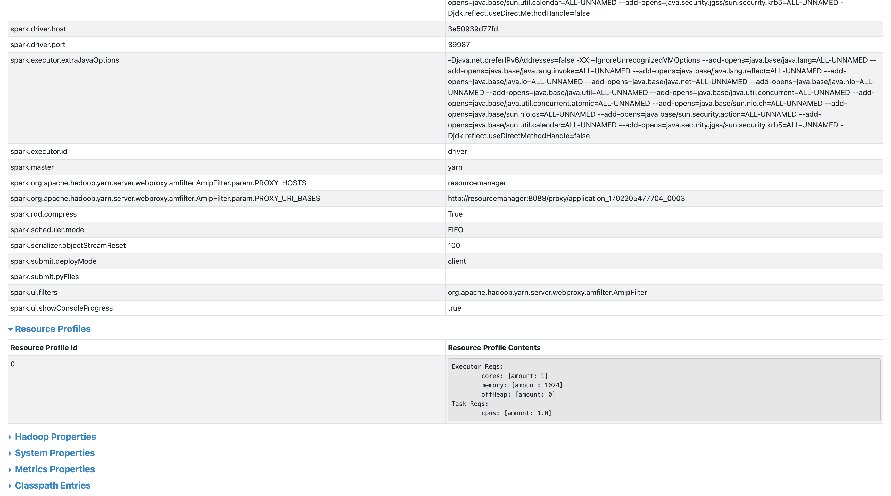

Посчитаем кол-во строк в датасетах ratings и tags с помощью экшена count().

Информация о выполненных job'ах в spark ui:

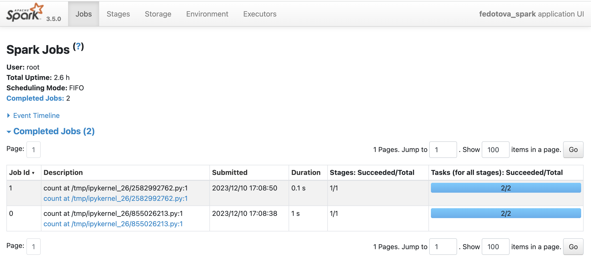
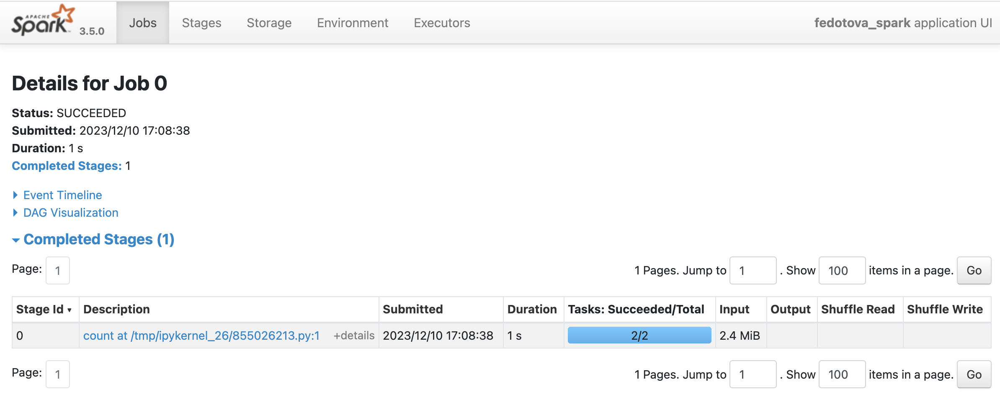
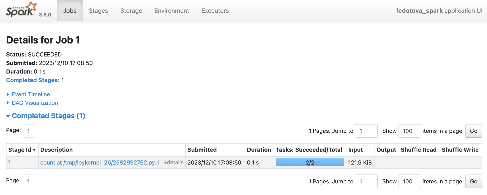

Всего было выполнено 2 stage'а:

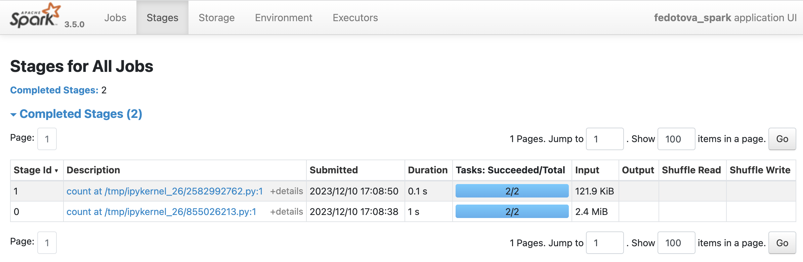

В каждом стейдже по 2 таски.

Почему? Таски -- это количество обработанных партиций. Метод count для подсчета всех строк
в датасете должен пройтись по всем партициям. Тк в нашей конфигурации 2 executer'а, т.е 2 партиции (можем проверить с
помощью метода getNumPartitions()), для обработки каждой из них требуется таска, суммарно требуется 2 таски в каждом
из стейджей.

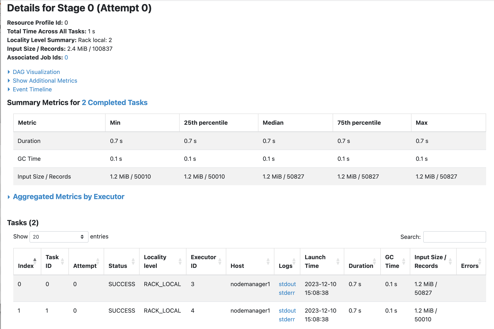
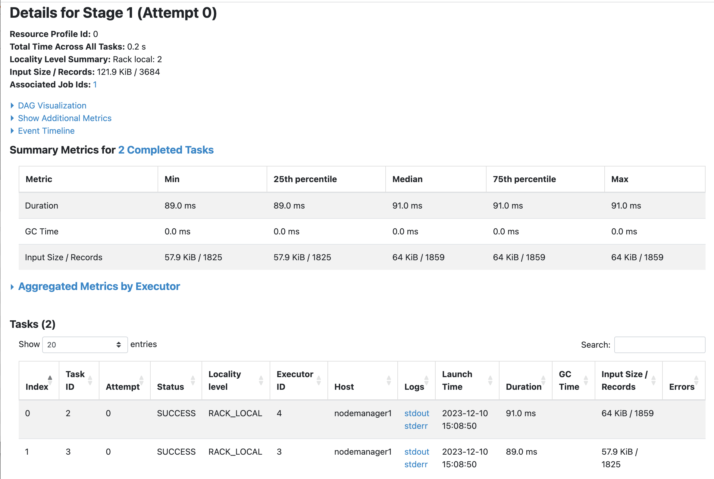

## Блок 2: Работа с данными

В ноутбуке: 

## Блок 3: UDF

DAG вычислений job'ы show после применения UDF:

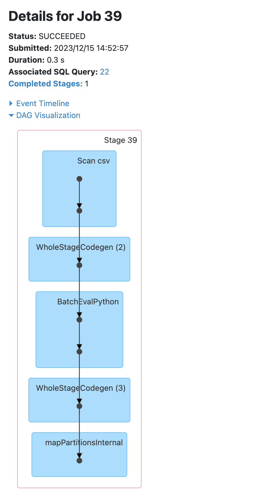
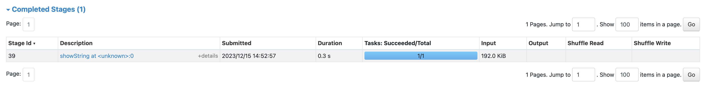

При подсчете RMSE генерируются 3 job'ы, в каждой по одному стейджу и одной таске:

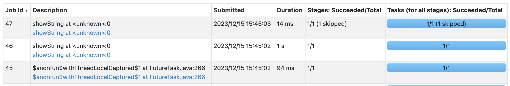
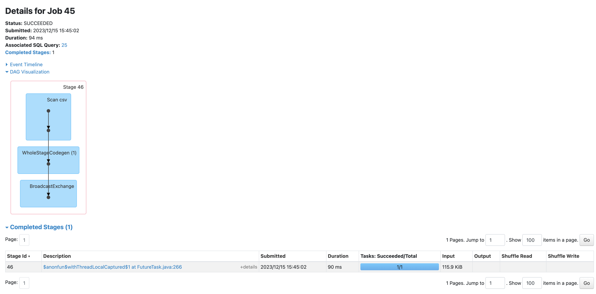
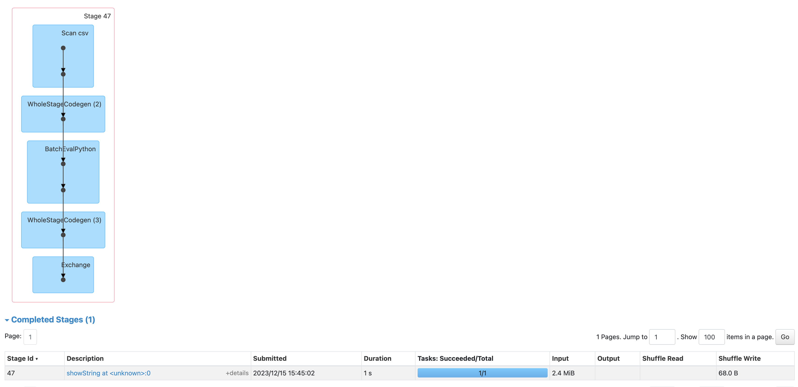
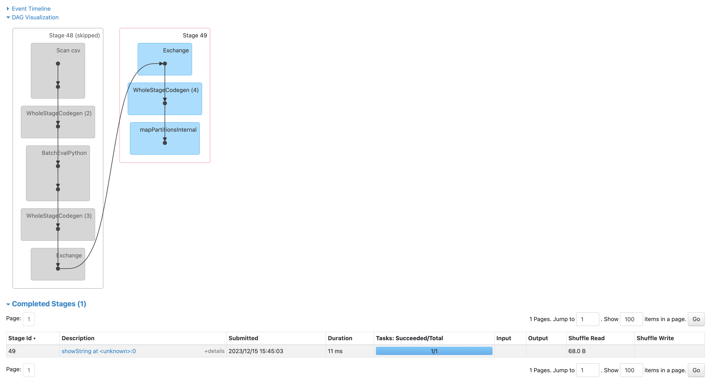
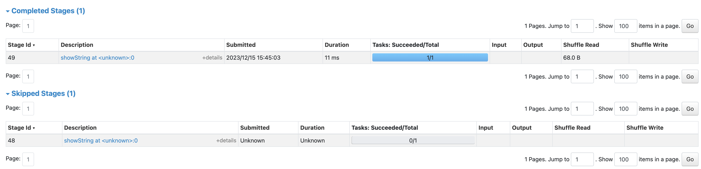
