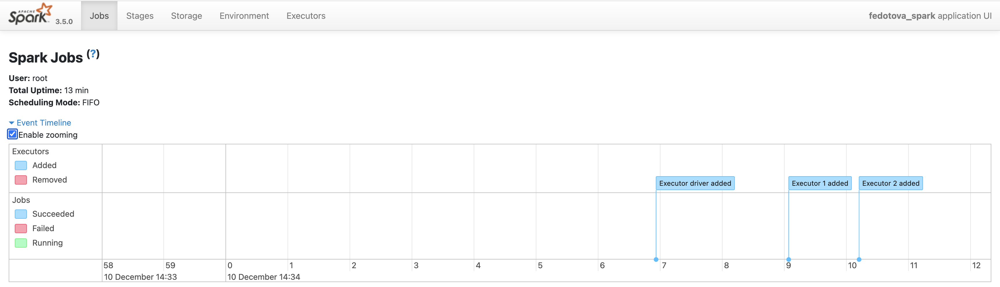

# Домашнее задание 2

## Блок 1: Spark Application

Развернем hadoop-кластер в конфигурации 1 namenode, 1 datanode, 1 resourcemanager, 1 nodemanager. Также развернем jupyter в контейнере

Запустим спарк-сессию (SparkSession) с мастером YARN, 2-мя экзекьюторами и именем приложения “fedotova_spark”, предварительно выйдя из savemode в hdfs (hdfs dfsadmin -safemode leave).

Зайдем в YARN, увидим развернувшееся приложение.

http://localhost:8088/cluster

http://localhost:8088/cluster/app/application_1702205477704_0003

UI приложения spark:

http://localhost:8088/proxy/application_1702205477704_0003/

